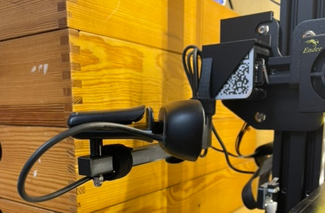

# Stuff to pimp my Ender 3 Pro

## endercam

endercam is a holder to recycle a Logitech 270 for use with Octoprint. Sits on top of the Z-axis servo and moves up and down with it to monitor the nozzle. I removed the weights from the Logitech clip and drilled a 3mm hole, to mount it with a screw.

I finally decided to use a Raspberry Pi camera instead of the Logitech and to add an adjustable arm. The case is simple but functional, screws are easy to reach to tighten.

