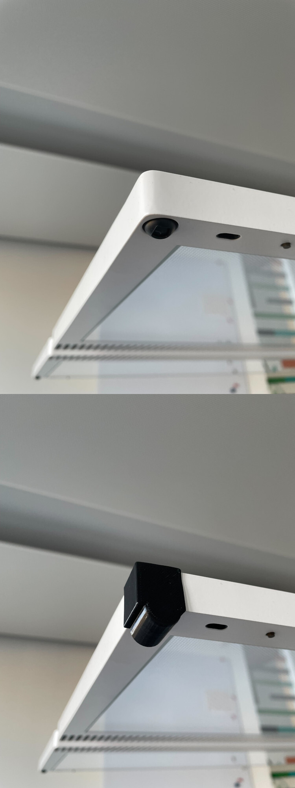

Things you can use to pimp your Regent office light, or make it usable.

The sensor-cover is to block the movement sensor, in case you can't configure it:

The switch-things are to make the top button more accessible, in case you don't like the auto on/off and can't easily reach the main buttons of your light. Make sure to connect the UI to the lever with a strong enough line:

